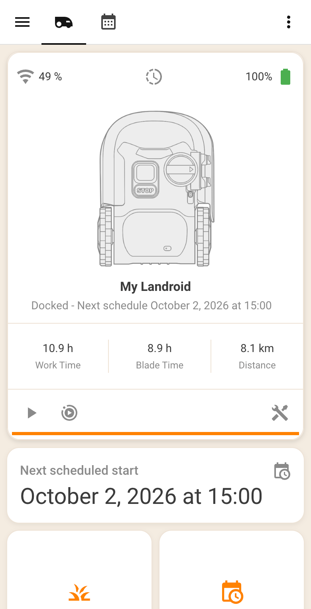

# Landroid dashboard for Home Assistant

A dedicated Home Assistant dashboard that imitates the Worx Landroid app – cream background, white rounded cards, orange accents, a big mower status card with a toolbar, app-style tiles (Edge routine, One Time Schedule, Party Mode, Lock) and a full weekly schedule editor.

Everything ships as plain YAML you copy or paste into an existing Home Assistant configuration – no HACS package, no install script.

## What you get

- **Home view** – the Worx app's Dashboard screen: a `landroid-card` status card with battery/info popups and a start/pause/dock/edge-cut toolbar, a work/blade/distance stats row, a "Next scheduled start" row and a 2-column grid of app-replica tiles.
- **Schedule view** – the Worx app's Schedule screen: "Up next" (next start, today's progress), quick-action tiles, the weekly schedule table with edge-cut flags, and a schedule editor that adds, edits and deletes weekly slots.
- **Schedule editor** – builds entries from day/start/duration/edge-cut helpers (with a "Repeat every day" shortcut), refuses to create exact duplicates, loads an existing slot on tap for editing, deletes on hold (with a duplicate-safe rebuild), and clears the whole week behind a confirmation.

## Prerequisites

- Home Assistant (any recent version; the YAML here uses the modern `perform-action` syntax).
- The **Landroid Cloud** integration ([MTrab/landroid_cloud](https://github.com/MTrab/landroid_cloud), v7 or newer) – its `add_schedule`, `edit_schedule`, `delete_schedule` and `ots` actions power the schedule editor and the One Time Schedule tile.
- Four custom cards from HACS (all in the HACS default list, category Lovelace):

| Card | Repository |
|---|---|
| `custom:landroid-card` | [Barma-lej/landroid-card](https://github.com/Barma-lej/landroid-card) |
| `custom:button-card` | [custom-cards/button-card](https://github.com/custom-cards/button-card) |
| `custom:flex-table-card` | [custom-cards/flex-table-card](https://github.com/custom-cards/flex-table-card) |
| `custom:auto-entities` | [thomasloven/lovelace-auto-entities](https://github.com/thomasloven/lovelace-auto-entities) 1.16+ |

Add each repository in HACS, download it, and register the resource URLs under Settings → Dashboards → Resources if your HACS does not do that automatically.

## Install

### Step 1 – rename the device (once, in the HA UI)

The dashboard expects the mower entity to be `lawn_mower.my_landroid` and its children to use the `my_landroid_` prefix. The Worx cloud generates a device name of its own, so rename the device once so the entity IDs become readable and match:

1. Settings → Devices & services → the Worx device → pencil icon.
2. Rename it to **My Landroid** and accept the option to update entity IDs (children regenerate to `my_landroid_*`).
3. Open the lawn mower entity → gear → make sure its entity ID is `lawn_mower.my_landroid`.
4. If any card on an existing dashboard already referenced the mower, point it at the new entity ID.

Nothing changes in the Worx cloud and entity history is preserved.

### Step 2 – enable the disabled entities (once, in the HA UI)

Most landroid_cloud entities are disabled by default. On the device page, enable each of these (gear dialog → Enabled):

- `button.my_landroid_edge_cut`
- `switch.my_landroid_party_mode`
- `switch.my_landroid_lock`
- `number.my_landroid_rain_delay`
- `number.my_landroid_time_extension`
- `number.my_landroid_torque`
- `sensor.my_landroid_next_schedule`
- `sensor.my_landroid_daily_progress`
- `sensor.my_landroid_signal_strength`
- `sensor.my_landroid_last_update`
- `sensor.my_landroid_rain_delay_remaining`
- `sensor.my_landroid_mower_runtime_total`
- `sensor.my_landroid_blade_runtime_total`
- `sensor.my_landroid_blade_runtime_since_reset`
- `sensor.my_landroid_blade_runtime_at_last_reset`
- `sensor.my_landroid_distance_driven_total`
- `sensor.my_landroid_battery_charge_cycles_total`
- `sensor.my_landroid_battery_charge_cycles_since_reset`
- `button.my_landroid_reset_blade_runtime`
- `select.my_landroid_zone`

A docked Landroid sleeps its WiFi, so new entities may show `unavailable`/`unknown` until the mower next wakes up – that is expected, not a fault. If an entity is still unavailable after a full mowing session, leave it disabled and skip it; the dashboard degrades gracefully.

### Step 2b – switch to a manual schedule (once, in the HA UI)

The schedule editor manages the weekly slots itself; Worx Auto Schedule would regenerate them over any manual edit. Before using the editor:

1. Enable `switch.my_landroid_auto_schedule` on the device page (disabled by default).
2. Switch it **off** and leave it off.

If Auto Schedule previously generated the week, "Clear week" on the Schedule view wipes those slots in one confirmed tap.

### Step 3 – deploy the files

| File in this repo | Deploy target |
|---|---|
| `themes/worx.yaml` | copy to `/config/themes/worx.yaml` (create the `themes/` folder if none exists) |
| `lovelace-landroid.yaml` | copy to `/config/lovelace-landroid.yaml` |
| `snippets/configuration-additions.yaml` | paste both blocks at the top level of `/config/configuration.yaml` |
| `snippets/input_number-additions.yaml` | paste both blocks into `/config/input_number.yaml` |
| `snippets/input_datetime-additions.yaml` | paste the block into `/config/input_datetime.yaml` |
| `snippets/input_select-additions.yaml` | paste the block into `/config/input_select.yaml` |
| `snippets/input_boolean-additions.yaml` | paste both blocks into `/config/input_boolean.yaml` |
| `snippets/input_text-additions.yaml` | paste both blocks into `/config/input_text.yaml` |
| `snippets/scripts-additions.yaml` | paste all seven blocks into `/config/scripts.yaml` |

Then Developer Tools → YAML → **Check configuration**, and restart Home Assistant. The **Landroid** dashboard appears in the sidebar with two views, Home and Schedule, both wearing the Worx theme. The restart is required – the theme loads at startup only.

## Usage notes

- **Asleep mower**: a docked Landroid sleeps its WiFi. While it sleeps, entities read `unavailable`, the tiles go grey with an "Asleep" label, stats show "–", and the schedule editor is replaced by an explanatory note – never an error state. Everything returns when the mower wakes.
- **One Time Schedule tile**: tap to mow once for the slider duration; hold the tile to open the slider and change the duration.
- **Slot tiles**: tap a "Your slots" tile to load it into the editor (the "Editing …" line appears), then adjust the fields and tap the orange **Save changes** button; hold a tile to delete it after a confirmation.
- **Duplicates**: the editor refuses to create two slots with the same day and start time (the mower cannot tell them apart). If duplicates ever appear anyway (for example left over from an earlier experiment), run the `landroid_schedule_dedupe_all` script from Developer Tools → Actions – it keeps one copy of each duplicated slot and reports what it removed as a persistent notification.
- **Worx Auto Schedule** stays unsupported in the dashboard – leave its switch off (Step 2b).

## Rollback

Delete `/config/themes/worx.yaml` and `/config/lovelace-landroid.yaml`, remove the pasted blocks from the seven configuration files, restart. The device rename and enabled entities can stay – they are harmless on their own.

## Troubleshooting

- **Tiles do nothing when tapped** – button-card's `perform-action` syntax needs a reasonably current version. Update the button-card download in HACS, then hard-refresh the browser (custom cards are cached).
- **"Your slots" fills with "Configuration error" boxes** – the auto-entities `filter.template` must evaluate to a native *list* of card configs (the `{{ ns.tiles }}` expression). auto-entities 1.16+ splits any text/YAML result on whitespace, turning each fragment into a junk entity with one error card each. Don't "simplify" the template back to YAML output.
- **Weekly schedule table is empty** – check Developer Tools → States → `sensor.my_landroid_next_schedule`. If the data lives in a differently shaped attribute, the table reads `schedule_entries` (day/start/duration/boundary); swap the column `data:` selectors accordingly, e.g. `schedule_entries.label` as a single column.
- **Stats show "–"** – the mower is asleep (entities unavailable). Values return when it wakes. If they never do, verify the runtime/distance sensors are enabled (Step 2).
- **Entity IDs don't match after the rename** – if some entities did not regenerate, rename them individually so they match the list above, or search-and-replace the IDs in `lovelace-landroid.yaml`.
- **Theme looks default** – confirm the `frontend: themes:` block was pasted, the file sits at `/config/themes/worx.yaml`, and HA was restarted (not just reloaded) at least once after adding the theme.

## License

MIT – see [LICENSE](LICENSE).
